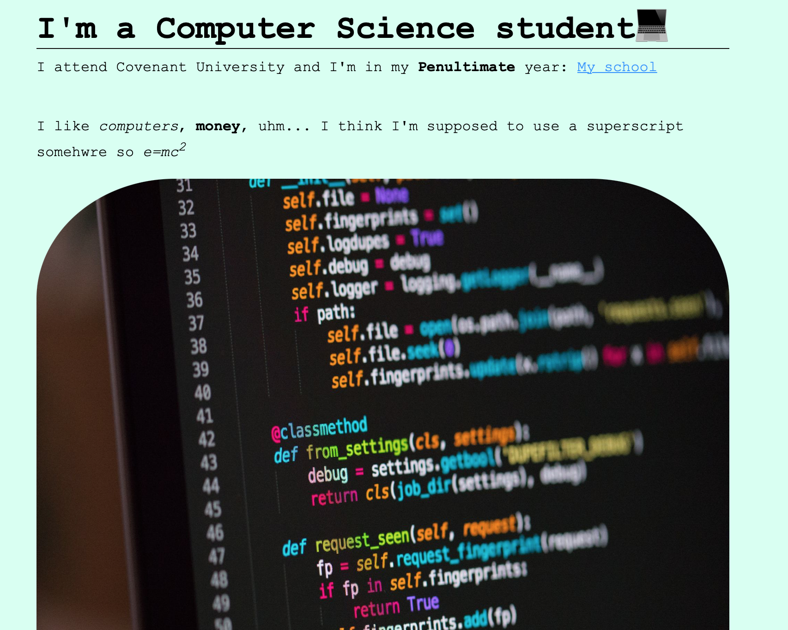
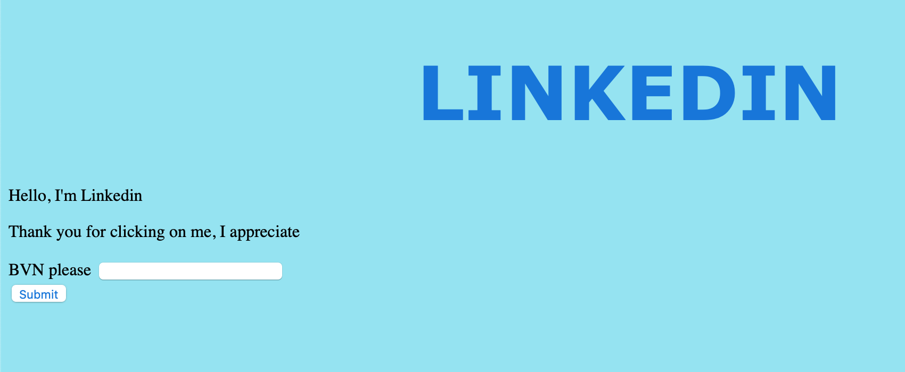

# NO CSS Website :computer:
I'm aware.
The code is scuffy and I just imported some random <small>CSS</small> file from the internet and it made the buttons pretty and centered the page. It's pretty much all I did.

Might change it later though

I also created a fake Linkedin page- cause why not  :shrug:

## Screenshots
### Website

 

### Fake Linkedin
